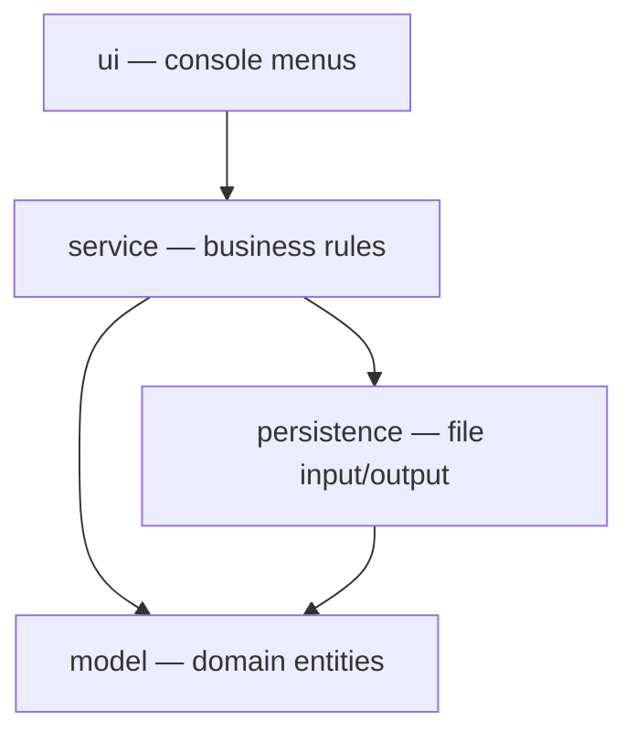

# GameZone Inova

Console application for managing a video game and console store: it registers products,
customers, sellers and sales, and updates the inventory automatically every time a sale is
registered. Data survives between runs through plain-text files, with no database involved.

Built in Java with a strict four-layer architecture as the workshop requires.

## Requirements

- JDK 17 or later
- Maven 3.8 or later

## Build

```
mvn clean package
```

## Run

```
java -jar target/gamezone-inova-1.0.0-SNAPSHOT.jar
```

The application must be run from the repository root, because the data files are read from and
written to the `data/` folder using relative paths.

## Architecture

Four layers under the `com.gamezone` package, with dependencies flowing in one direction only:
`ui → service → persistence → model`.



| Layer | Responsibility |
|---|---|
| `model` | Domain entities: `Person`, `Customer`, `Seller`, `Product`, `VideoGame`, `Console`, `Sale`. Depends on nothing. |
| `persistence` | Reads and writes the files under `data/`: `PersonRepository`, `ProductRepository`, `SaleRepository`. |
| `service` | Business rules and coordination: `PersonService`, `ProductService`, `SaleService`. |
| `ui` | `ConsoleUI`, the only class that talks to the user. Never touches a repository. |

## Data files

Plain text, one record per line, fields separated by `;`:

| File | Format |
|---|---|
| `data/products.txt` | `VIDEOGAME;id;title;price;quantity;platform;genre;ageRating`<br>`CONSOLE;id;title;price;quantity;brand;model;generation` |
| `data/customers.txt` | `id;name;phone;email` |
| `data/sellers.txt` | `id;name;phone;employeeCode;shift` — preloaded with three sellers |
| `data/sales.txt` | `id;date;customerId;sellerId;productId1,productId2,...` |
| `data/returns.csv` | `id;date;saleId;productId1,productId2,...;reason;refundAmount` |

Sales store only the ids of what they reference; the objects are resolved against the products and
people already loaded in memory when the application starts.

## Available operations

**Products:** register a video game · register a console · list the inventory
**People:** register a customer · list customers · list sellers
**Sales:** register a sale · full sales history · history by customer · history by seller
**Returns:** register a return · full return history · history by customer · history by sale · monthly balance

Registering a sale validates that it has at least one product, that the customer, the seller and
every product exist, and that there is enough stock for every unit requested; only then is the
inventory discounted and the sale saved.

Registering a return validates that the original sale exists, that no more than 30 calendar days
have passed since it was made, and that every product being returned really belongs to that sale;
only then is the stock restored and the return saved. The monthly balance subtracts the refunds of
a month from the sales of that same month.

## Documentation

- [TEAM.md](TEAM.md) — members, roles and committed activities
- [docs/analysis.md](docs/analysis.md) — answers to the orienting questions
- [docs/hierarchy-diagram.md](docs/hierarchy-diagram.md) — inheritance in the model layer
- [docs/class-diagram.md](docs/class-diagram.md) — full class diagram of the four layers
- [docs/return-analysis.md](docs/return-analysis.md) — answers to the return module orienting questions
- [docs/return-class-diagram.md](docs/return-class-diagram.md) — class diagram of the return module
- [docs/layers-diagram.md](docs/layers-diagram.md) — layer dependencies
- [docs/ai-usage/](docs/ai-usage) — AI usage logs of each team member

## License

MIT — see [LICENSE](LICENSE).
