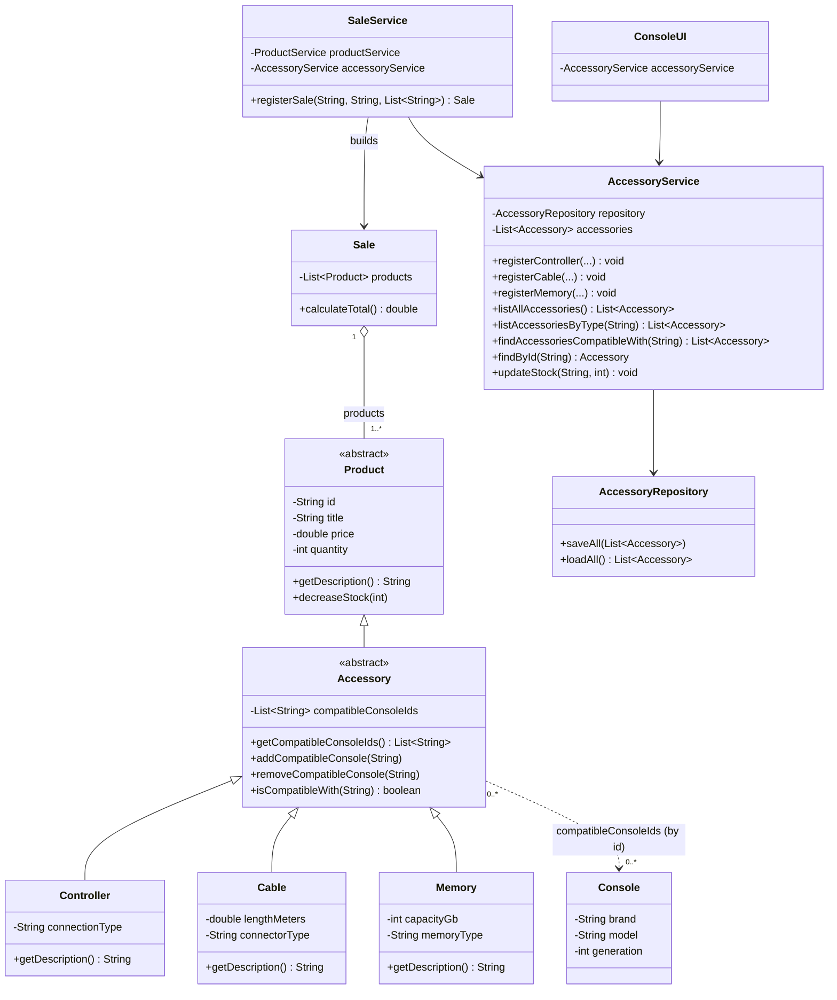

# Accessory Module — Class Diagram

Class diagram of the accessory module and its integration with the classes that already
existed before this module. Attributes and methods shown here are exactly the ones
implemented in the source code. Existing classes are shown only with the members the
module touches.

## Notes

- `Accessory` extends `Product`, not a new independent hierarchy (see
  [docs/accessory-analysis.md](accessory-analysis.md), Q1) — that is what lets `Sale`'s
  existing `List<Product> products` hold accessories with no changes to `Sale` itself.
- The dotted arrow from `Accessory` to `Console` is intentionally not a normal association:
  compatibility is stored as a list of console **ids** on `Accessory`
  (`compatibleConsoleIds`), not as direct references to `Console` objects, and `Console`
  carries nothing back — the relationship is unidirectional (Q3).
- `SaleService` depends on both `ProductService` (already existing) and `AccessoryService`
  (new, additive constructor parameter) to resolve a sold item and discount its stock
  regardless of which catalog it belongs to (Q4).
