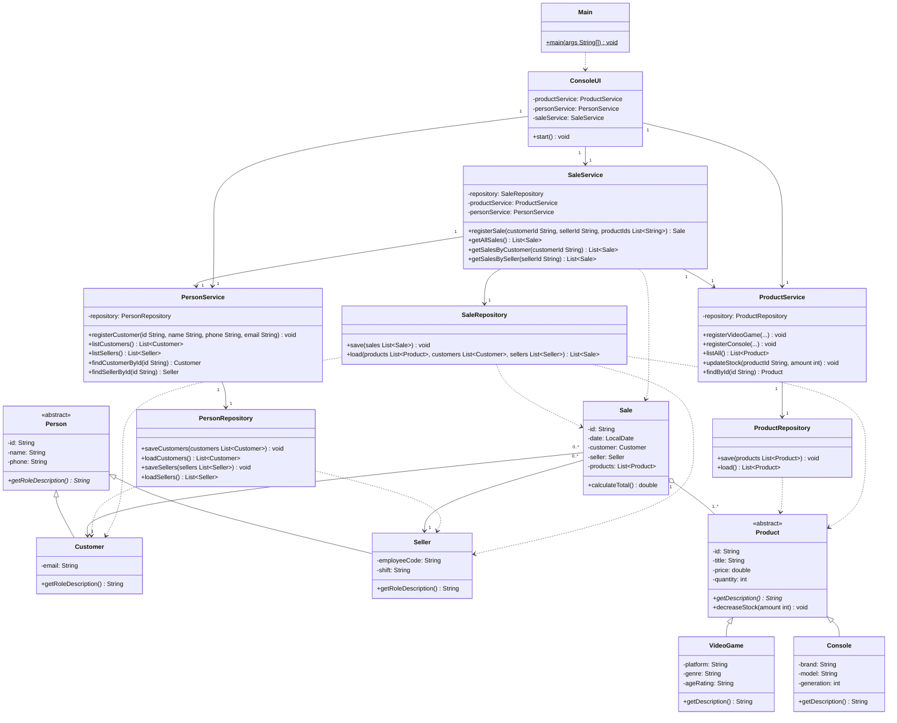

# Class Diagram — GameZone Inova

Complete class diagram of the four layers, with UML visibility (`+` public, `-` private), abstract
classes and abstract methods marked, and multiplicity on every relationship. Attributes and methods
shown here are exactly the ones implemented in the source code.

## Notes on the relationships

- **Inheritance:** `Person <|-- Customer/Seller` and `Product <|-- VideoGame/Console`.
- **Association:** `Sale --> Customer` and `Sale --> Seller`, with multiplicity `0..*` to `1`; many
  sales may reference the same person, and the person exists independently of any sale.
- **Aggregation:** `Sale o-- Product` (`1..*`); the sale groups products that live in the inventory
  on their own.
- **Dependency:** repositories and services depend on the model classes they read, write or
  orchestrate; `Main` depends on `ConsoleUI` only to launch it.
- A `Customer` deliberately does **not** hold a list of its own sales: keeping that list inside the
  model would couple `Customer` to `Sale` for no benefit. The purchase history is resolved on demand
  by `SaleService.getSalesByCustomer(...)`, which filters the sales it already holds.
- `SaleRepository.load(...)` receives the products, customers and sellers it needs to resolve the
  ids stored in `data/sales.txt`. They are passed in by `SaleService`, the layer above, instead of
  being pulled from the services: that keeps `persistence` depending only on `model` and never
  inverts the layer direction defined in [layers-diagram.md](layers-diagram.md).
