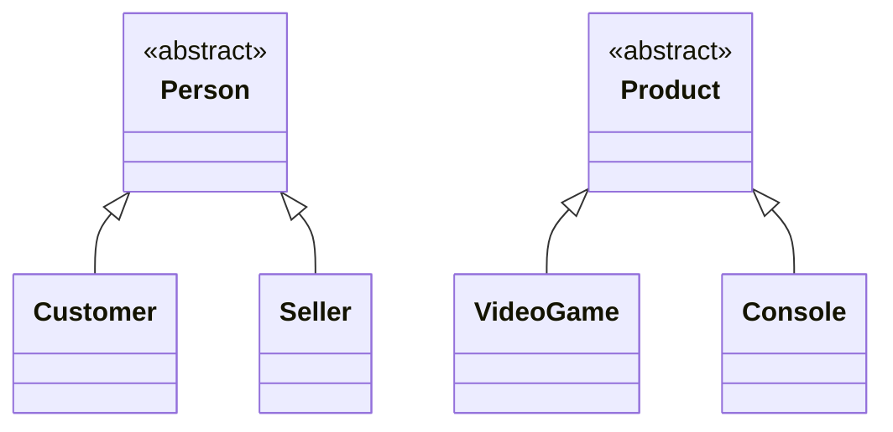

# Hierarchy Diagram — Model Layer

Inheritance relationships of the model layer only, without attributes or methods. Abstract classes
are marked with the `<<abstract>>` stereotype; every other class is concrete and instantiable.

`Person` and `Product` are abstract because neither a "generic person" nor a "generic product" is a
real entity of the store: every person is a customer or a seller, and every product is a video game
or a console. `Sale` does not appear in this diagram because it takes part in no inheritance
relationship; its associations are shown in [class-diagram.md](class-diagram.md).
