# Integrated Class Diagram

This diagram brings together products, accessories, promotions, warranties,
sales and returns across the four application layers.

Domain attributes and the service state relevant to integration are shown.
Constructors, routine accessors, repository constants and some supporting
members are omitted. Existing module diagrams provide additional detail.

```mermaid
classDiagram
    namespace model {
        class Person {
            <<abstract>>
            -String id
            -String name
            -String phone
            +getRoleDescription() String*
        }
        class Customer {
            -String email
        }
        class Seller {
            -String employeeCode
            -String shift
        }
        class Product {
            <<abstract>>
            -String id
            -String title
            -double price
            -int quantity
            +getDescription() String*
            +decreaseStock(int amount) void
        }
        class VideoGame {
            -String platform
            -String genre
            -String ageRating
        }
        class Console {
            -String brand
            -String model
            -int generation
        }
        class Accessory {
            <<abstract>>
            -List~String~ compatibleConsoleIds
            +isCompatibleWith(String consoleId) boolean
        }
        class Controller {
            -String connectionType
        }
        class Cable {
            -double lengthMeters
            -String connectorType
        }
        class Memory {
            -int capacityGb
            -String memoryType
        }
        class Promotion {
            <<abstract>>
            -String id
            -String name
            -LocalDate startDate
            -LocalDate endDate
            +isActive(LocalDate date) boolean
            +calculateDiscount(Sale sale) double*
        }
        class PercentageDiscount {
            -double percentage
            +calculateDiscount(Sale sale) double
        }
        class CategoryDiscount {
            -double percentage
            -String targetCategory
            +calculateDiscount(Sale sale) double
        }
        class BulkPurchaseDiscount {
            -int minimumQuantity
            -double percentage
            +calculateDiscount(Sale sale) double
        }
        class Sale {
            -String id
            -LocalDate date
            -Customer customer
            -Seller seller
            -List~Product~ products
            -double extraCost
            -String appliedPromotionName
            -double discountAmount
            +calculateSubtotal() double
            +calculateTotal() double
            +addExtraCost(double amount) void
            +canBeReturned() boolean
            +generateReceipt() String
        }
        class Warranty {
            <<abstract>>
            -String id
            -Product product
            -Sale sale
            -LocalDate startDate
            -LocalDate endDate
            +getDurationInMonths() int
            +getWarrantyType() String
            +getAdditionalCost() double
            +isActive(LocalDate date) boolean
            +generateWarrantyCertificate() String
        }
        class BasicWarranty {
            +getAdditionalCost() double
        }
        class ExtendedWarranty {
            +getAdditionalCost() double
        }
        class Return {
            -String id
            -LocalDate date
            -Sale originalSale
            -List~Product~ returnedProducts
            -String reason
            -double refundAmount
            -double warrantyRefund
            -discountRatio() double
            +calculateRefundAmount() double
            +generateReturnReceipt() String
        }
    }

    namespace persistence {
        class ProductRepository
        class PersonRepository
        class AccessoryRepository
        class SaleRepository {
            +save(List~Sale~ sales) void
            +load(List~Product~ products, List~Customer~ customers, List~Seller~ sellers) List~Sale~
        }
        class PromotionRepository {
            +saveAll(List~Promotion~ promotions) void
            +loadAll() List~Promotion~
        }
        class WarrantyRepository {
            +saveAll(List~Warranty~ warranties) void
            +loadAll(List~Product~ products, List~Sale~ sales) List~Warranty~
        }
        class ReturnRepository {
            -SaleService saleService
            -ProductService productService
            -AccessoryService accessoryService
            +saveAll(List~Return~ returns) void
            +loadAll() List~Return~
        }
    }

    namespace service {
        class ProductService {
            +restoreStock(String id, int amount) void
        }
        class PersonService
        class AccessoryService {
            -AccessoryRepository repository
            -List~Accessory~ accessories
            +listAllAccessories() List~Accessory~
            +findById(String id) Accessory
            +updateStock(String id, int amount) void
            +restoreStock(String id, int amount) void
        }
        class PromotionService {
            -PromotionRepository repository
            -List~Promotion~ promotions
            +listActivePromotions() List~Promotion~
            +findBestPromotionFor(Sale sale) Promotion
        }
        class SaleService {
            -SaleRepository repository
            -ProductService productService
            -PersonService personService
            -PromotionService promotionService
            -AccessoryService accessoryService
            -WarrantyService warrantyService
            -List~Sale~ sales
            +registerSale(String customerId, String sellerId, List~String~ productIds, List~String~ extendedWarrantyIds) Sale
            +setWarrantyService(WarrantyService warrantyService) void
            +findById(String id) Sale
        }
        class WarrantyService {
            -WarrantyRepository repository
            -List~Warranty~ warranties
            +assignBasicWarranty(Product product, Sale sale, LocalDate startDate) BasicWarranty
            +assignExtendedWarranty(Product product, Sale sale, LocalDate startDate) ExtendedWarranty
            +cancelWarranties(String productId, String saleId) double
        }
        class ReturnService {
            -ReturnRepository repository
            -SaleService saleService
            -ProductService productService
            -AccessoryService accessoryService
            -WarrantyService warrantyService
            -List~Return~ returns
            +registerReturn(String saleId, List~String~ productIds, String reason) Return
            +calculateMonthlySales(int month, int year) double
            +calculateMonthlyReturns(int month, int year) double
            +generateMonthlyBalance(int month, int year) double
        }
    }

    namespace ui {
        class ConsoleUI {
            +start() void
        }
    }

    class Main {
        +main(String[] args) void
    }

    Person <|-- Customer
    Person <|-- Seller
    Product <|-- VideoGame
    Product <|-- Console
    Product <|-- Accessory
    Accessory <|-- Controller
    Accessory <|-- Cable
    Accessory <|-- Memory

    Promotion <|-- PercentageDiscount
    Promotion <|-- CategoryDiscount
    Promotion <|-- BulkPurchaseDiscount
    Promotion ..> Sale : evaluates
    CategoryDiscount ..> Accessory : recognizes category
    Accessory ..> Console : compatibility by identifier

    Sale --> Customer
    Sale --> Seller
    Sale o-- Product : sold items
    Warranty <|-- BasicWarranty
    Warranty <|-- ExtendedWarranty
    Warranty --> Product : covers
    Warranty --> Sale : originates from
    Return --> Sale : original sale and discount
    Return o-- Product : returned items

    ProductService --> ProductRepository
    PersonService --> PersonRepository
    AccessoryService --> AccessoryRepository
    PromotionService --> PromotionRepository
    SaleService --> SaleRepository
    WarrantyService --> WarrantyRepository
    ReturnService --> ReturnRepository

    SaleService --> ProductService
    SaleService --> PersonService
    SaleService --> AccessoryService
    SaleService --> PromotionService : discount before warranties
    SaleService --> WarrantyService : assigns warranties

    WarrantyService ..> SaleRepository : constructor loads sales
    WarrantyService ..> ProductService : constructor resolves products
    WarrantyService ..> PersonService : constructor resolves people

    ReturnService --> SaleService : finds original sale
    ReturnService --> ProductService : restores product stock
    ReturnService --> AccessoryService : restores accessory stock
    ReturnService --> WarrantyService : cancels console warranties

    ReturnRepository --> SaleService : resolves sale identifiers
    ReturnRepository --> ProductService : resolves product identifiers
    ReturnRepository --> AccessoryService : resolves accessory identifiers

    ProductRepository ..> Product
    PersonRepository ..> Customer
    PersonRepository ..> Seller
    AccessoryRepository ..> Accessory
    SaleRepository ..> Sale
    PromotionRepository ..> Promotion
    WarrantyRepository ..> Warranty
    ReturnRepository ..> Return

    ConsoleUI --> ProductService
    ConsoleUI --> PersonService
    ConsoleUI --> AccessoryService
    ConsoleUI --> PromotionService
    ConsoleUI --> SaleService
    ConsoleUI --> WarrantyService
    ConsoleUI --> ReturnService

    Main ..> ConsoleUI : constructs and starts
    Main ..> SaleService : constructs and connects
    Main ..> WarrantyService : constructs before SaleService
    Main ..> ReturnRepository : constructs with services
    Main ..> ReturnService : constructs
```

## Reading the diagram

- Inheritance arrows point to the superclass.
- Solid arrows represent retained references or associations.
- Dotted arrows represent use, construction or identifier-based dependencies.
- `WarrantyService` uses `SaleRepository` during construction; it does not
  retain a `SaleService` reference.
- `ReturnRepository` depends on three services. These arrows show an existing
  exception to the intended layer direction.
- `Main` performs application wiring. Its principal integration connections
  are shown; it constructs the remaining repositories and services as well.

## Integration behavior

- A1 adds accessories to category promotions.
- A2 removes the dependency from `WarrantyService` to `SaleService`.
- A3 applies the promotion before assigning warranties.
- A4 routes accessory stock restoration through `AccessoryService`.
- A5 calculates proportional item refunds from the original sale discount.
- A6 exposes monthly sales, returns and net balance separately.
- A7 removes matching warranties and includes their costs in the return.

See [Integration analysis](integration-analysis.md) for implementation
details and limitations.