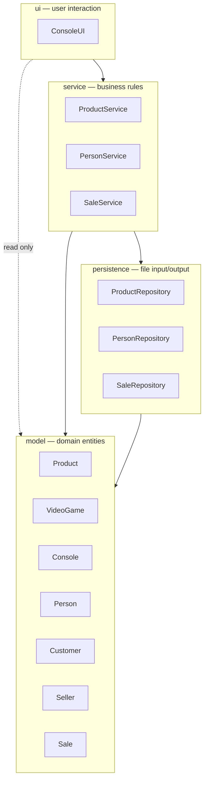

# Layers Diagram — GameZone Inova

The system is organized into four layers under the `com.gamezone` package. Arrows show the only
dependency directions allowed; any arrow in the opposite direction is forbidden.

## Responsibility of each layer

| Layer | Responsibility | Depends on |
|---|---|---|
| `ui` | Reads user input and prints results on the console, in Spanish. Never touches files. | `service`, and `model` for reading only |
| `service` | Enforces the business rules (stock availability, at least one product per sale) and coordinates persistence. | `persistence`, `model` |
| `persistence` | Reads and writes the plain-text files under `data/`. Knows nothing about business rules. | `model` |
| `model` | Pure domain entities with their own state and behavior. | nothing |

## Why the direction matters

Dependencies flow strictly inward: `ui → service → persistence → model`. The `model` layer depends
on nothing, which keeps the domain stable and reusable — it can be tested without a file system and
without a console. Reversing any arrow, for example letting `Product` write itself to a file, would
couple the domain to a storage format and to the input mechanism, breaking the single
responsibility principle and making every layer harder to replace or test on its own. The user
interface is also forbidden from skipping a layer: `ConsoleUI` never instantiates a repository
directly, it always goes through a service.

The dotted arrow from `ui` to `model` is the one nuance of this diagram. `ConsoleUI` receives
`Product`, `Customer`, `Seller` and `Sale` objects back from the services and reads them to print
their data on screen, so it does depend on the domain classes. That dependency is read-only and
still points inward, which is why it does not break the rule: the console never persists a domain
object, never applies a business rule to it and never reaches a repository to get one — every
object it prints came from a service call.
