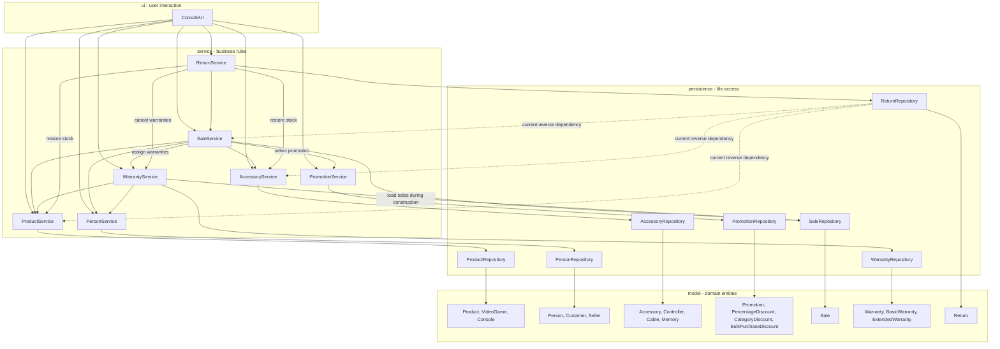

# Layers Diagram - GameZone Inova

The application is organized into four packages: `ui`, `service`,
`persistence` and `model`.

The intended direction is from user interaction to services, persistence
and domain entities. The diagram also records the current exception:
`ReturnRepository` uses services to resolve saved identifiers.

```mermaid
flowchart TB
    subgraph UI["ui - user interaction"]
        ConsoleUI
    end

    subgraph SERVICE["service - business rules"]
        ProductService
        PersonService
        AccessoryService
        PromotionService
        SaleService
        WarrantyService
        ReturnService
    end

    subgraph PERSISTENCE["persistence - file access"]
        ProductRepository
        PersonRepository
        AccessoryRepository
        PromotionRepository
        SaleRepository
        WarrantyRepository
        ReturnRepository
    end

    subgraph MODEL["model - domain entities"]
        Products["Product, VideoGame, Console"]
        People["Person, Customer, Seller"]
        Accessories["Accessory, Controller, Cable, Memory"]
        Promotions["Promotion, PercentageDiscount, CategoryDiscount, BulkPurchaseDiscount"]
        Sale
        Warranties["Warranty, BasicWarranty, ExtendedWarranty"]
        Return
    end

    ConsoleUI --> ProductService
    ConsoleUI --> PersonService
    ConsoleUI --> AccessoryService
    ConsoleUI --> PromotionService
    ConsoleUI --> SaleService
    ConsoleUI --> WarrantyService
    ConsoleUI --> ReturnService

    ProductService --> ProductRepository
    PersonService --> PersonRepository
    AccessoryService --> AccessoryRepository
    PromotionService --> PromotionRepository
    SaleService --> SaleRepository
    WarrantyService --> WarrantyRepository
    ReturnService --> ReturnRepository

    SaleService --> ProductService
    SaleService --> PersonService
    SaleService --> AccessoryService
    SaleService -->|select promotion| PromotionService
    SaleService -->|assign warranties| WarrantyService

    WarrantyService -->|load sales during construction| SaleRepository
    WarrantyService --> ProductService
    WarrantyService --> PersonService

    ReturnService --> SaleService
    ReturnService -->|restore stock| ProductService
    ReturnService -->|restore stock| AccessoryService
    ReturnService -->|cancel warranties| WarrantyService

    ReturnRepository -.->|current reverse dependency| SaleService
    ReturnRepository -.->|current reverse dependency| ProductService
    ReturnRepository -.->|current reverse dependency| AccessoryService

    ProductRepository --> Products
    PersonRepository --> People
    AccessoryRepository --> Accessories
    PromotionRepository --> Promotions
    SaleRepository --> Sale
    WarrantyRepository --> Warranties
    ReturnRepository --> Return
```

## Responsibilities

| Layer | Responsibility |
|---|---|
| `ui` | Reads input and displays results in Spanish through `ConsoleUI`. |
| `service` | Validates operations and coordinates sales, promotions, warranties, stock and returns. |
| `persistence` | Serializes and reconstructs records stored under `data/`. |
| `model` | Holds domain state and calculates amounts, validity and descriptions. |

The diagram emphasizes service coordination and repository connections.
Services also use model objects, and the UI reads model objects returned
by services to display results.

## Integration dependencies

`SaleService` selects a promotion before assigning console warranties.
It coordinates both product and accessory inventories.

`WarrantyService` loads sale references through `SaleRepository`,
using products and people supplied by their services. It does not
depend on `SaleService`.

`ReturnService` restores stock through the appropriate inventory service
and requests warranty cancellation for returned consoles.

`Main`, outside these four packages, constructs and connects the
repositories, services and console interface.

## Existing architecture exception

`ReturnRepository` depends on `SaleService`, `ProductService` and
`AccessoryService` to resolve identifiers while loading returns.

Consequently, the current implementation does not fully satisfy strict
one-way layer dependencies. This is shown explicitly rather than hidden.

A separate refactoring could pass the required domain collections or
lookups into the repository, following the approach of `SaleRepository`.

## Related documentation

- [Integrated class diagram](integrated-class-diagram.md)
- [Integration analysis](integration-analysis.md)