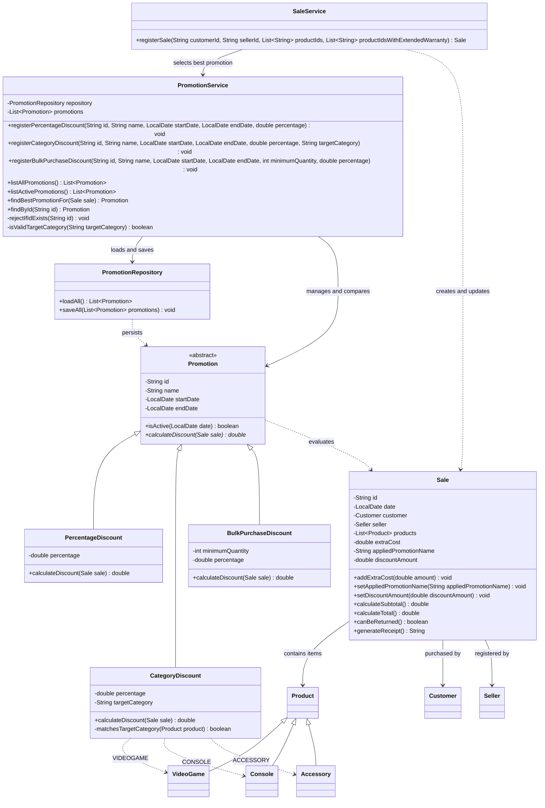

# Promotion Class Diagram

The diagram shows the promotion hierarchy and its integration with sales.
Domain attributes are listed for the promotion classes and `Sale`.
Supporting classes show only the members relevant to this module;
constructors and routine accessors are omitted.

## Integration notes

- `CategoryDiscount` recognizes accessories through `instanceof Accessory`.
- `PromotionService` accepts `VIDEOGAME`, `CONSOLE` and `ACCESSORY` when
  registering a category discount.
- Only the active promotion offering the highest positive discount applies.
- `SaleService` assigns the promotion before generating warranties.
- Warranty costs are added separately from the item subtotal used for discounts.