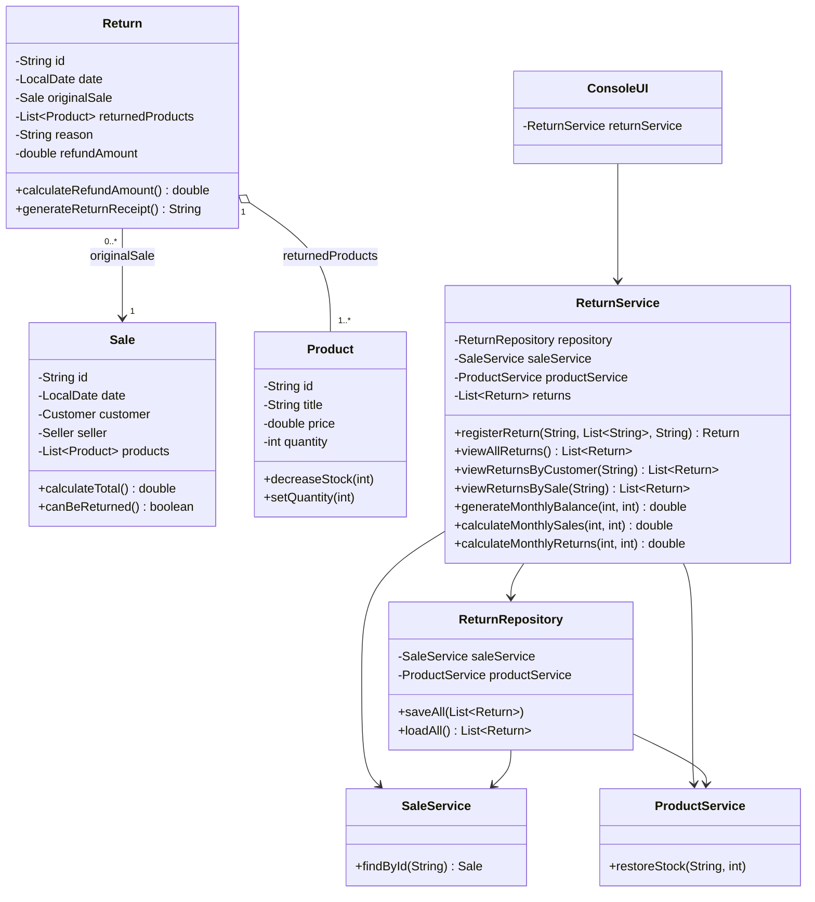

# Return Module — Class Diagram

Class diagram of the return module and its integration with the classes that already
existed in Taller 1. Attributes and methods shown here are exactly the ones implemented in
the source code. Existing classes are shown only with the members the module touches.

