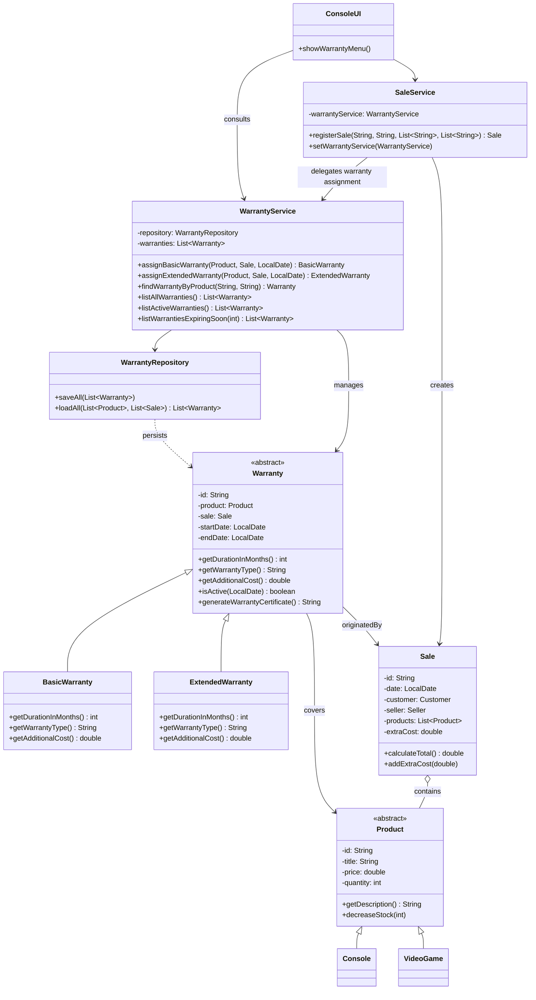

# Warranty Module Class Diagram

```mermaid
classDiagram
class Product {
<<abstract>>
-id: String
-title: String
-price: double
-quantity: int
+getDescription() String
+decreaseStock(int)
}
class Console
class VideoGame
Product <|-- Console
Product <|-- VideoGame

class Warranty {
<<abstract>>
-id: String
-product: Product
-sale: Sale
-startDate: LocalDate
-endDate: LocalDate
+getDurationInMonths() int
+getWarrantyType() String
+getAdditionalCost() double
+isActive(LocalDate) boolean
+generateWarrantyCertificate() String
}

class BasicWarranty {
+getDurationInMonths() int
+getWarrantyType() String
+getAdditionalCost() double
}

class ExtendedWarranty {
+getDurationInMonths() int
+getWarrantyType() String
+getAdditionalCost() double
}

Warranty <|-- BasicWarranty
Warranty <|-- ExtendedWarranty
Warranty --> Product : covers
Warranty --> Sale : originatedBy

class Sale {
-id: String
-date: LocalDate
-customer: Customer
-seller: Seller
-products: List~Product~
-extraCost: double
+calculateTotal() double
+addExtraCost(double)
}
Sale o-- Product : contains

class WarrantyRepository {
+saveAll(List~Warranty~)
+loadAll(List~Product~, List~Sale~) List~Warranty~
}
WarrantyRepository ..> Warranty : persists

class WarrantyService {
-repository: WarrantyRepository
-warranties: List~Warranty~
+assignBasicWarranty(Product, Sale, LocalDate) BasicWarranty
+assignExtendedWarranty(Product, Sale, LocalDate) ExtendedWarranty
+findWarrantyByProduct(String, String) Warranty
+listAllWarranties() List~Warranty~
+listActiveWarranties() List~Warranty~
+listWarrantiesExpiringSoon(int) List~Warranty~
}
WarrantyService --> WarrantyRepository
WarrantyService --> Warranty : manages

class SaleService {
-warrantyService: WarrantyService
+registerSale(String, String, List~String~, List~String~) Sale
+setWarrantyService(WarrantyService)
}
SaleService --> WarrantyService : delegates warranty assignment
SaleService --> Sale : creates

class ConsoleUI {
+showWarrantyMenu()
}
ConsoleUI --> WarrantyService : consults
ConsoleUI --> SaleService
```
